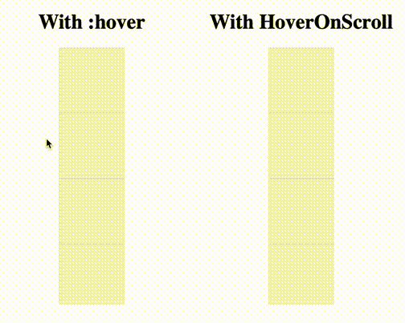

# HoverOnScroll



HoverOnScroll is a JavaScript library that adds support to hover effects while scrolling the window or a container, it was developed to overcome the limitation of browsers to apply the css ```:hover``` effect during scroll

## Sample

The sample available on the dev folder could be run following those steps

```shell
npm install
npm run start
```

## Properties

```typescript jsx
import HoverOnScroll from "@antonio-goncalves/hover-on-scroll";

const hoverOnScroll = new HoverOnScroll([elementToHover1,elementToHover2],options)

function destroy(){
    hoverOnScroll.destroy()
}
```
### ElementToHover
First parameter of HoverOnScroll constructor

| Name         | Type   | is Optional | Description                                                               |
|--------------|--------|-------------|---------------------------------------------------------------------------|
| elementClass | string | no          | Class of the element where the "hoverClass" must be applied when hovering |
| hoverClass   | string | no          | Class which will be applied to the element to enable the hover effect     |

### Options
Second parameter of HoverOnScroll constructor, this parameter is optional


| Name          | Type                 | is Optional | Description                                                                                                                       |
|---------------|----------------------|-------------|-----------------------------------------------------------------------------------------------------------------------------------|
| mouseOffset   | number               | yes         | Minimum Y value to be considered when listening the mouse position, this could be useful to allow the hover effect behind navbars |
| initialMousePosition | {x:Number, y:Number} | yes         | Initial mouse position                                                                                                            |
| scrollingElements | Element[] (DOM)      | yes         | Elements where the onScroll event will be attached, useful for containers with scroll                                             |
| touchBehaviour | TouchBehaviour       | yes         | Options specific for touch devices                                                                                                |                                             
### TouchBehaviour

Those options are only relevant for touch devices.

| Name          | Type            | is Optional | Description                                                                                                       |
|---------------|-----------------|-------------|-------------------------------------------------------------------------------------------------------------------|
| scrollWhenTouch   | boolean         | yes         | Set to true, to scroll to the element on touch                                                                    |
| offsetWhenScroll | Number          | yes         | vertical offset for the behaviour described on the previous option, is useful to place the content below a navbar |
     